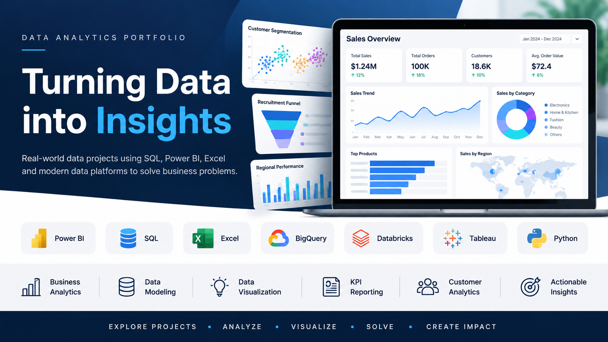

  

## 👩‍💻 About Me

I'm **Narmada Somasundaram**, a Data Analyst focused on transforming raw data into meaningful business insights through analysis, visualization, and dashboard development.

- 📊 Skilled in **Power BI, Advanced Excel, SQL, Tableau, and Data Visualization**
- 🔍 Experienced in **data cleaning, analysis, dashboard development, and KPI reporting**
- 📈 Passionate about turning complex datasets into clear, actionable insights
- 🗂️ Built analytics projects including **E-Commerce Sales & Customer Analytics, Recruitment Funnel Analysis, and Worldwide Furniture Sales Dashboard**
- 🌱 Continuously expanding my skills in **Python and modern data analytics tools**

## 🛠️ Technical Skills

- **Data Visualization:** Power BI, Tableau, Advanced Excel
- **Data Analysis:** Excel, SQL, Power Query, DAX
- **Programming:** Python
- **Databases:** MySQL, SQL Server
- **Analytics:** Data Cleaning, Data Transformation, Exploratory Data Analysis, KPI Reporting
- **Tools:** GitHub, Microsoft Fabric

## 📂 Featured Projects

### 🛒 [E-Commerce Sales & Customer Analytics](https://github.com/NarmadaAnalytics/E-commerce-sales-customer-analytics)

End-to-end e-commerce analytics project analyzing sales performance, customer behavior, and customer value to uncover actionable business insights.

**Tools:** BigQuery | SQL | Power BI | RFM Analysis

---

### 👥 [Recruitment Funnel Analysis](https://github.com/NarmadaAnalytics/Recruitment-funnel-analysis)

Analyzed the recruitment funnel to identify candidate drop-off points and evaluate hiring performance across departments and sourcing channels.

**Tools:** SQL | Power BI | Data Visualization

---

### 📊 [Worldwide Furniture Sales Analysis](https://github.com/NarmadaAnalytics/Worldwide-Furniture-Sales-Analysis)

Analyzed worldwide furniture sales data to uncover trends in sales performance, profitability, customer contribution, product categories, and regional performance.

Built an interactive Excel dashboard to present key KPIs and business insights through PivotTables, PivotCharts, slicers, and Excel formulas.

**Tools:** Microsoft Excel · PivotTables · PivotCharts · Slicers · Excel Formulas · Data Analysis · Data Visualization · Dashboard Design

## 🎓 Certifications & Credentials

- 📊 **Data Analyst in Power BI** — DataCamp
- 🎓 **Certificate of Professional Learning in Data Analytics** — McMaster University
- 🏅 **Academy Accreditation – Databricks Fundamentals** — Databricks
- 🏅 **Academy Accreditation – Azure Databricks Platform Architect** — Databricks
- 
- ## 🤝 Connect With Me

I'm always open to connecting with fellow data professionals and exploring opportunities in Data Analytics.

- 💼 **LinkedIn:** [Narmada Minu Somasundaram](https://www.linkedin.com/in/narmada-minu-somasundaram/)
- 💻 **GitHub:** [NarmadaAnalytics](https://github.com/NarmadaAnalytics)
